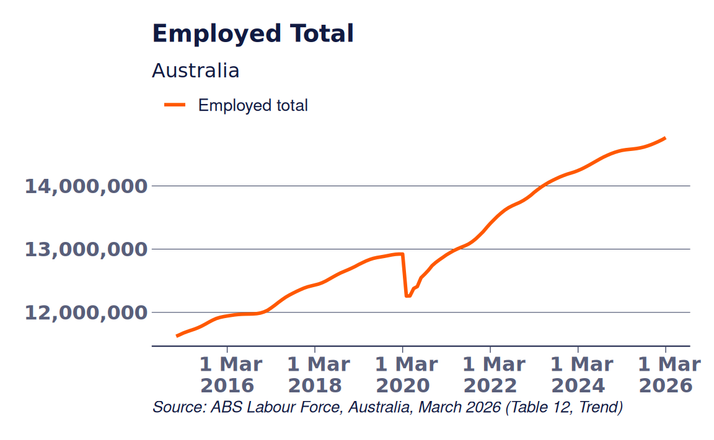

# Plotting ABS Time Series Data

``` r

library(reportabs)
labour_force <- read_absdata("labour_force")
```

[`abs_plot()`](https://amwu-nrc.github.io/reportabs/reference/abs_plot.md)
will do most of the heavy lifting for you, if you know the indicator you
want to plot. If not, typing plot\_ and pressing tab will show the
included plots.
`abs_plot(labour_force, indicator = "Employed total", type = "labour_force")`
is identical to `plot_employed_total("Australia")`.

``` r

abs_plot(labour_force, filter_with = list(indicator = "Employed total", state = "Australia"), type = "labour_force")
#> Warning: implied series_type = 'Trend'
#> Trying Google Fonts... Found! Downloading font to /tmp/RtmpMOHFJF
```


